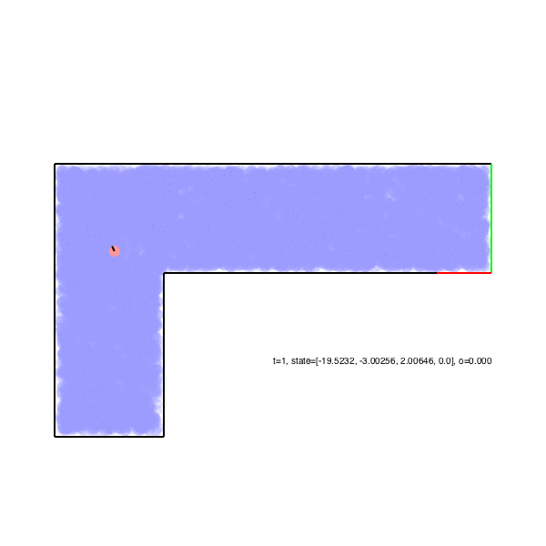

# AA228FinalProject
Codebase for the optional final project of AA228 Autumn 2018.

An example video showing the robot first localizing itself using its bump sensors, then navigating safely to the goal. The Roomba's belief about where it may be located is represented by the blue regions, and is updated using a particle filter.


## Installation
Clone this repository using
```
git clone https://github.com/sisl/AA228FinalProject.git
```
and `cd` into it.

Then, run the following commands in Julia:
```julia
import POMDPs
POMDPs.add_registry()
```

Enter the package manager by hitting the ```]``` key. Then activate the AA228FinalProject environment with the command:
```
activate .
```
Once activated, your prompt should become:
```
(AA228FinalProject) pkg> 
```
Now run the following command to install all the necessary dependencies:
```
instantiate
```
Note: if you're running Windows and have trouble building the POMDPSolve and SARSOP dependencies, don't worry. It shouldn't interfere with you being able to get started. We're looking into whether the build issues can be resolved. 


## Getting Started
Run the ```lidar_roomba.ipynb``` jupyter notebook to become familiar with the Roomba environment. This will walk you through a step-by-step example of how to set up the environment, define a baseline policy, and evaluate the performance of the policy. The example uses a lidar sensor; in your work you will be expected to solve the environment using only the bump sensor. 

Next, familiarize yourself with the source code by examining the files in the ```src``` directory. A brief description of the files is given below:
* ```AA228FinalProject.jl``` - defines the package module for this project and includes the necessary import and export statements
* ```roomba_env.jl``` - defines the environment as a POMDPs.jl MDP and POMDP
* ```env_room.jl``` - defines the environment room and rectangles used to define it
* ```line_segment_utils.jl``` - functions for determining whether the Roomba's path interects with a line segment and struct defining line segments
* ```filtering.jl``` - specification of particle filters for the bumper and lidar Roomba environments

In case changes are made later, please do not modify any of the scripts in the ``src`` directory on your computer. Write all of your own code in a separate directory. If you feel like you need to change one of these files, please talk to the course staff and we will discuss other possible options.

## Adding additional packages or running files from terminal
If you would like to add additional packages or run files from terminal, please follow the procedure below.
In julia, first enter the package manager by hitting the ```]``` key. Then activate the AA228FinalProject environment by following the instructions in the Installation section. Packages you now add will be added to the AA228FinalProject environment, and if you exit the package manager (by pressing backspace), the code you run while the environment is activated will have access to all packages specified in the ```Project.toml``` file.

## Contact
If you have questions, first check the FAQ section on course webpage [here](https://web.stanford.edu/class/aa228/cgi-bin/wp/optional-final-project-escape-roomba), and post on the course Piazza in the ```optional_final_project``` folder if your question is unanswered.
